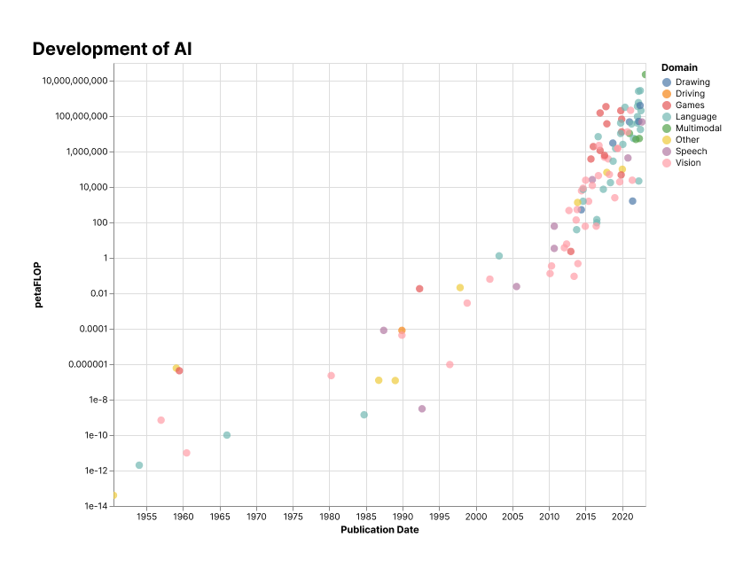
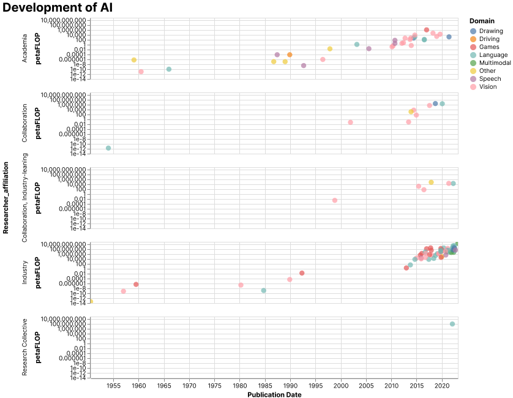
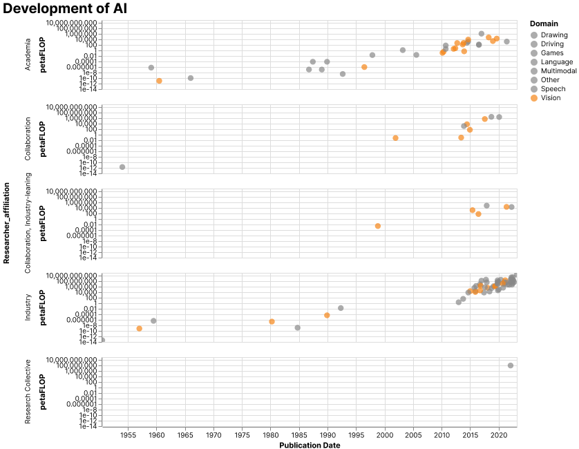
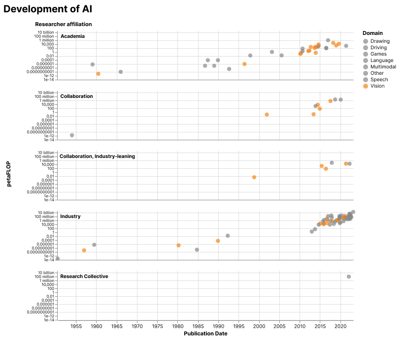

# Visualization Redesign 

BEFORE creating your plot, determine: 
    - **What message** is important to me to communicate, to **whom**, and **why**? 
    - What data do I want to show? Can I show it in one chart, or do I need to facet it out to help manage the visual complexity of the story that I want to tell?

1. Create your base plot in your tool of choice (I like to use vega-altair, but anything that will allow you to eventally save out a svg file works)
    
    
2. Export your plot as svg
3. Create an empty Figma file 
4. Draw out a frame (hotkey: F) in the size of the Figure (e.g., half-width A4)
5. Drag your svg file into your Figma file window into the frame you just created, and adjust scale as needed
6. Based on message you want to communicate, if your data allow this, AND color is not part of the data encoding already, consider designing with grey. 
   - For instance, select all data points other than a given category of interest.
        - To directly select graphic of interest, hotkey: _cmd click_ on Mac, _ctrl shift 4_ on Windows; hold down _shift_ to select multiple objects, then group them to easily select later (hotkey: _cmd g_ on Mac, _ctrl g_ on Windows)
   - Then choose a grey value to assign to this group, and voila! You are managing to still show all of your data, but push it into the background so that it is no longer competing with your main story. 
   - Then, select your main category/data item, and choose a high-contrast color that will help make your data stand out. In my example, I have chosen orange.
   
7. Declutter your visualization to make it easier to read, e.g.,  
   - Reduce/remove gridlines
   - Remove unnecessary legends 
   - Don't make your viewer tilt their head to read your chart axis labels - no diagonal text, avoid vertical
   
8. Last, but not least: think about TEXT as just as important as the visuals in your science graphic! You want to tell your reader what they should learn from your figure, don't make them sit and try to puzzle it out themselves. This entails:
    - Move legends (if you still have after decluttering) closer to the actual data to improve readability
    - Write the title of your chart like a newspaper headline that captures the key takeaways of the chart and uses concise, active language
    - Add explainers that help clarify features in your visualization 
      - Captions/chart subtitle
      - Callout box - in my example, I have added a caption box that explains to my audience what a FLOP is
      - Add references to your data source
      - Add annotations (labels) on top of your chart to call out important features (for some types of data, this may be considered image manipulation and not be allowed, so if you ever are unsure, discuss with colleagues)
9. Export your graphic out from Figma:
   - Select your Figma frame
   - At the bottom of the right-hand panel, there is an Export menu. For maximum resolution, export your graphic as svg or pdf, if possible. If it must be a raster image file, use png. 
